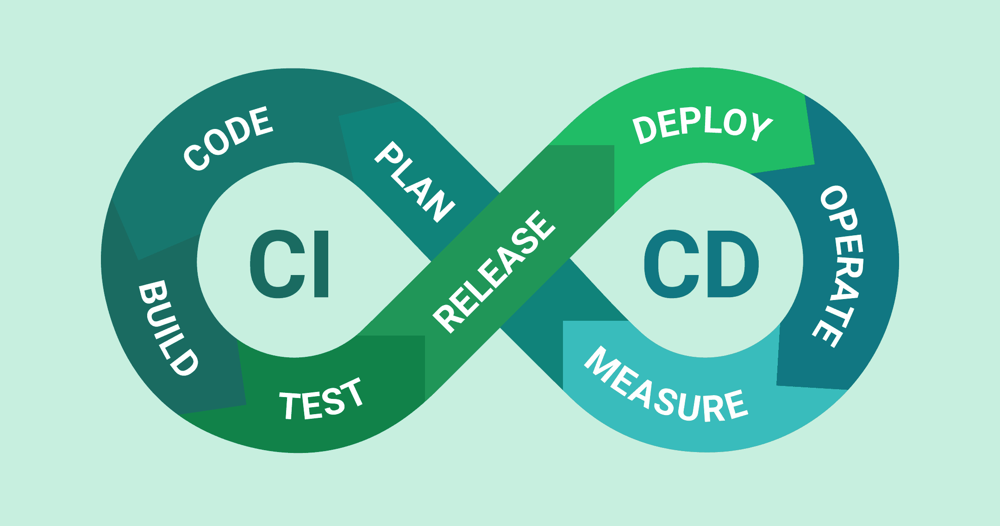

# CI/CD

Vous connaissez déjà les notions, je ne vais pas m'attarder sur le but de la CI et CD. Deux petites images pour se remettre les idées en place :

## Outils
Gitlab et Github proposent tous les deux des outils pour la mise en place de tout cela. J'utilise personnellement Gitlab CI, mais tout cela est facilement transposable à Github Actions.

## CI
La CI repose sur quelques principes fondamentaux :
- standardisation du code ( [PSR-12](https://www.php-fig.org/psr/psr-12/), SonarQube, ESLint, Pylint, PHPStan)
- tests (phpunit, pytest, dotnet test, ...)
- coverage (quel pourcentage de votre code est testé)
- vérifications générales (nom des branches, des commits, [conventionnal commits](https://www.conventionalcommits.org/en/v1.0.0/) ...)
- la sécurité (SAST/SCA), GitLab intègre nativement des scans de sécurité (dépendances vulnérables, secrets commités par erreur...)
- lien vers les tickets en cours (gitlab issues, jira, ...)

Elle s'effectue à cheval entre les machines individuelles des développeurs et dans les premières étapes dans gitlab ou github. Normalement, à chaque commit avec les hooks Git (pre-commit, commit-msg), ou avant chaque push (avec [husky](https://unsiteavous.fr/astuces/config/husky-votre-assistant-git/)), un certain nombre de vérifications sont lancées, pour s'assurer que le code à envoyer est conforme aux exigences du projet et de l'équipe. cela permet de garder une base de code propre et maintenable dans le temps.

## CD
Là aussi, quelques principes fondamentaux :
- build ((p)npm build, ...)
- deploy (vers des environnements variés, test, preprod, prod)
- rollback (avec sauvegardes)
- releases (marqueurs des versions)
- gestion des secrets (variables d'environnement, ... )

Une fois le code prêt à une mise en condition réelle, on passe à la CD. le build est une étape utile pour des langages qui doivent compiler leur code. les frameworks front, dotnet, ... 
Il n'est pas forcément utile pour tous les langages.

les releases servent à versionner le code. je vous encourage à mettre en place [semantic release](https://github.com/semantic-release/semantic-release), qui va s'appuyer sur vos commits pour créer des releases automatiques. 

les déploiements vont être multiples. Vous en aurez au minimum deux, preprod et prod. le but de preprod est de pouvoir vérifier que la montée de version se passe bien, et que rien n'est cassé avant d'effectuer la même chose en prod. Normalement, les étapes de CD devraient être identiques entre ces deux étapes, seules changent les variables d'environnement.

La grosse différence entre preprod et prod réside dans le fait que le déploiement en prod est **manuel**, c'est-à-dire qu'il ne se lancera pas tant que vous ne l'avez pas décidé.

les rollbacks automatisés sont obligatoires dès lors qu'on déploie automatiquement. Avant chaque déploiement, faire une sauvegarde de toutes les données utilisateur (BDD, fichiers). Si jamais le déploiement échoue, le rollback se lance alors, pour revenir à l'état d'avant. Grâce à cela, le site n'est jamais en rade, et vous aurez les erreurs dans les logs pour vous aider à diagnostiquer le bug.

## Observabilité
Il existe une autre étape souvent négligée mais essentielle, c'est le suivi en temps réel de l'app en ligne, que ce soit pour les ressources côté serveur ([grafana](https://grafana.com/), [netdata](https://www.netdata.cloud/), ...), ou la disponibilité côté client ([better stack](https://betterstack.com/), [Kener](https://github.com/rajnandan1/kener), ...). Ces outils permettent d'être alerté en cas de down, de suivre la montée en charge d'une app, et d'analyser les statistiques.

Surveiller son site en ligne est un élément très important, car nous ne travaillons pas H24 sur la même chose, et parfois le site peut rester des semaines sans qu'on ne fasse une mise à jour ou autre. Si rien ne le surveille, on peut passer à côté de certaines choses. 

## Conclusion
Il faut bien garder en tête que la CI/CD, c'est une automatisation de toutes les étapes qu'on devrait faire à la main pour passer du code sur notre environnement de développement au code en production. Non seulement, ces étapes peuvent être longues et fastidieuses, mais en plus nous avons de grandes chances d'oublier de réaliser une petite commande ici ou là, ce qui serait catastrophique pour le site en production, et difficile à diagnostiquer. L'automatisation a l'avantage d'être bête et méchante, une fois qu'elle a des instructions claires, elle les suit sans jamais en dévier.